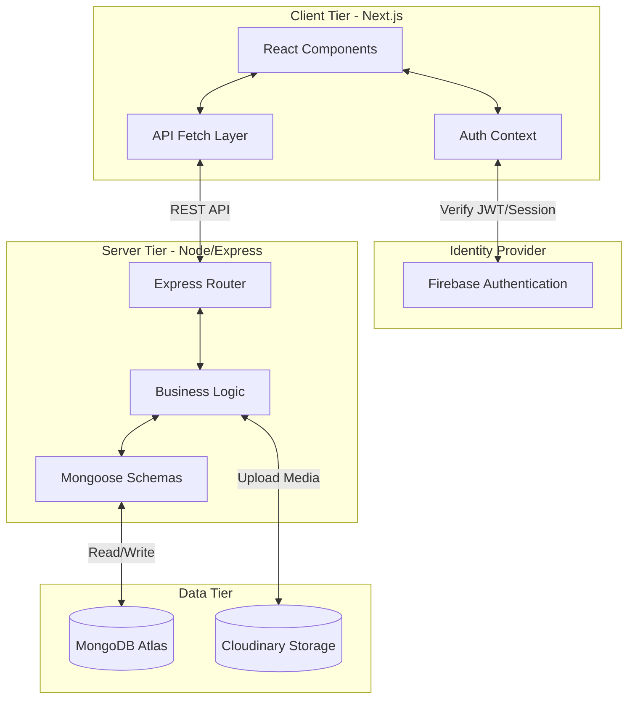

<div align="center">
  
  <h1>MyLinkedIn - Professional Community Platform</h1>
  
  <p>A modern, full-stack social networking platform built with Next.js, React, Firebase, MongoDB, and Express.js.</p>

  <!-- Badges -->
  <p>
    
    
    
    
    
  </p>

  <h3>
    <a href="https://mylinkedin-platform.vercel.app/">Live Demo</a>
    <span> | </span>
    <a href="#-system-architecture">Architecture</a>
    <span> | </span>
    <a href="#-api-reference">API Docs</a>
  </h3>
</div>

<hr />

## 🌟 Overview

MyLinkedIn provides essential professional networking features including secure user authentication, rich profile management, real-time social feeds, and dynamic post creation with media support. 

## 🏗 System Architecture

The application follows a decoupled client-server architecture.



## 📸 Platform Interface

| Homepage & Landing | Main Feed |
| :---: | :---: |
|  |  |
| *Beautiful landing page with CTA* | *Dynamic social feed with updates* |

| User Profile | Post Creation |
| :---: | :---: |
|  |  |
| *Comprehensive profile management* | *Rich post creation with media* |

## 🚀 Key Features

* **Authentication & Security:** Secure email/password login powered by Firebase Auth, with protected routes and persistent user sessions.
* **Professional Profiles:** Highly customizable user profiles with avatars, bios, and historical post tracking.
* **Social Engagement:** Create, like, and share text and media posts in a real-time responsive feed.
* **Industry-Grade UI:** A modern, accessible, and fully responsive design built utilizing Tailwind CSS, Shadcn UI, and smooth-scrolling with Lenis.

## 🛠 Tech Stack

| Domain | Technologies |
| :--- | :--- |
| **Frontend** | Next.js 15 (App Router), React 19, Tailwind CSS, Shadcn UI, Framer Motion |
| **Backend** | Node.js, Express.js |
| **Database & Storage** | MongoDB, Mongoose, Cloudinary |
| **Authentication** | Firebase Authentication |
| **Tooling** | ESLint, PostCSS |

## 📦 Installation & Setup

### Prerequisites
- Node.js (v18+)
- Local MongoDB or MongoDB Atlas URI
- Firebase Project Setup

### 1. Clone & Install
```bash
git clone https://github.com/nims-creation/MyLinkedIn.git
cd MyLinkedIn

# Install frontend dependencies
npm install

# Install backend dependencies
npm run server:install
```

### 2. Environment Configuration

Create a `.env.local` in the **root** directory:
```env
NEXT_PUBLIC_API_URL=http://localhost:5000/api
NEXT_PUBLIC_FIREBASE_API_KEY=your_key
NEXT_PUBLIC_FIREBASE_AUTH_DOMAIN=your_domain
NEXT_PUBLIC_FIREBASE_PROJECT_ID=your_id
NEXT_PUBLIC_FIREBASE_STORAGE_BUCKET=your_bucket
NEXT_PUBLIC_FIREBASE_MESSAGING_SENDER_ID=your_sender_id
NEXT_PUBLIC_FIREBASE_APP_ID=your_app_id
```

Create a `.env` in the **server** directory:
```env
MONGODB_URI=mongodb://localhost:27017/mylinkedin
PORT=5000
```

### 3. Run the Application
```bash
# Windows users can use the startup script:
.\start-dev.bat

# Or run manually in two terminals:
# Terminal 1: Backend
npm run server

# Terminal 2: Frontend
npm run dev
```

## 📖 API Reference

### User Management
| Method | Endpoint | Description |
| :--- | :--- | :--- |
| `GET` | `/api/users/:uid` | Retrieve a user's profile |
| `POST` | `/api/users` | Create/Update profile data |
| `GET` | `/api/users/search` | Search users by name/keyword |

### Post Engagement
| Method | Endpoint | Description |
| :--- | :--- | :--- |
| `GET` | `/api/posts` | Fetch paginated feed |
| `POST` | `/api/posts` | Create a new post |
| `POST` | `/api/posts/:postId/like` | Toggle like status |
| `POST` | `/api/posts/:postId/share`| Share post |

### Media
| Method | Endpoint | Description |
| :--- | :--- | :--- |
| `POST` | `/api/upload` | Upload images/media |

## 🛡 Security & Best Practices

- **Token Validation:** API endpoints require valid Firebase JWTs.
- **Data Sanitization:** Mongoose schemas enforce strict data typing.
- **CORS Configuration:** Restricted cross-origin requests on the backend.
- **Environment Variables:** All secrets are kept out of source control via `.gitignore`.

## 🤝 Contributing

Contributions are what make the open source community such an amazing place to learn, inspire, and create. Any contributions you make are **greatly appreciated**.

1. Fork the Project
2. Create your Feature Branch (`git checkout -b feature/AmazingFeature`)
3. Commit your Changes (`git commit -m 'Add some AmazingFeature'`)
4. Push to the Branch (`git push origin feature/AmazingFeature`)
5. Open a Pull Request
